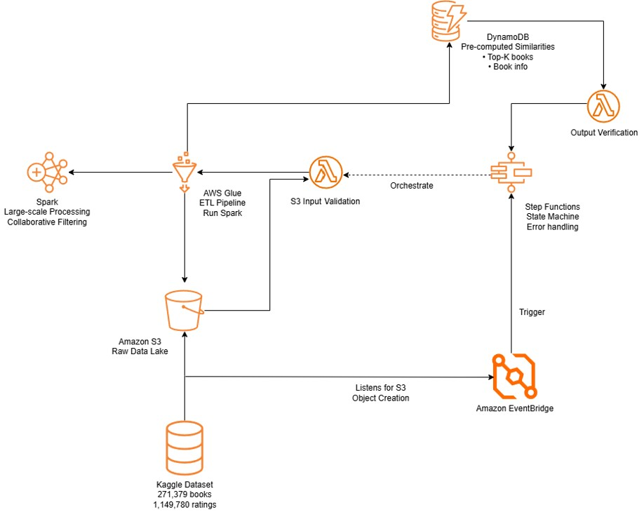

# Better Read Data Pipeline

This repository folder contains data ingestion and model generation pipeline for our Better Read web application.  
It automates the end-to-end workflow of validating uploaded data, training a recommendation model, and verifying the outputs before sinking them to DynamoDB for the Frontend to access.

The pipeline is triggered automatically when new raw data files are uploaded to an S3 bucket. It uses **AWS EventBridge**, **Step Functions**, **Lambda**, **Glue**, and **DynamoDB** to perform data validation, model training, and result verification.

### Pipeline Overview

### Workflow Summary

1. **EventBridge Rule** — Listens for S3 `Object Created` events in `book-recommender-raw-data` s3 bucket and starts the Step functions workflow.
2. **Step Functions State Machine** — Orchestrates the pipeline:
   - `ValidateInput`: Runs a Lambda function to validate uploaded CSVs.
   - `StartGlueJob`: Trains the recommendation model and writes results to DynamoDB.
   - `VerifyOutput`: Runs a Lambda function to ensure job success and output completeness.
3. **Input Validation Lambda** 
   - In order to proceed to the glue job, the laambda function first checks if the necessary input is present
   - Both `Books.csv` and `Ratings.csv` need to be present before the pipeline proceeds with the next stage.
4. **Glue Job - performs a series of Extract, Transform, Load steps**
   - Data ingestion: CSV files are read from S3 into Spark DataFrames.
   - Data cleaning: Ratings of zero are treated as implicit feedback and are filtered out for better model performance.
   - Training the ALS model: The Alternating Least Squares algorithm is applied to the training data to learn latent factors representing user and book preferences. Model parameters include a maximum of 10 iterations, a regularization parameter of 0.1, and a latent factor rank of 10. The coldStartStrategy is set to drop to handle users or items with missing ratings in the test set.
   - Similarity computation: Item factors produced by the ALS model are extracted and used to compute a cosine similarity matrix. For each book, the top 20 most similar books are identified. These results form the basis of the recommendation dataset.
   - Data loading: Book metadata and similarity scores are converted to Glue DynamicFrames and written to respective DynamoDB tables.

6. **DynamoDB Tables** — Store processed data:
   - `Books`: Metadata for each book.
   - `BookSimilarities`: Top-20 similar books and similarity scores.
7. **Output Verification Lambda**
   - Confirms that the Glue job ran successfully.
   - Verifies that DynamoDB tables `Books` and `BookSimilarities` exist and contain a minimum number of records.
   - Returns a summary of checks and overall verification status.

### Deployment Guide

#### Pre-requisites
1. AWS account with permissions for S3, Lambda, Glue, Step Functions, EventBridge, and DynamoDB
2. S3 bucket: `book-recommender-raw-data`
3. DynamoDB tables: `Books` and `BookSimilarities`

#### Steps
1. Deploy Lambda functions
   - Create two Lambda functions:
        - book-recommender-input-validation
        - book-recommender-output-verification
   - Upload the corresponding .py files.

2. Deploy Glue Job
    - Create a Glue job named book-recommender.
    - Use book_recommender_job.py as the script source.

3. Create Step Functions Workflow
    - Create state machine.
    - Choose "Author with JSON" and paste the content of state-machine.json.
    - Update <ACCOUNT_ID> placeholders.

4. Create EventBridge Rule
    - Use the CloudFormation template eventbridge-rule.json.
    - Set target as the Step Functions ARN.

5. Upload Data
    - Upload both Books.csv and Ratings.csv to the book-recommender-raw-data bucket.
    - This triggers the workflow automatically.
